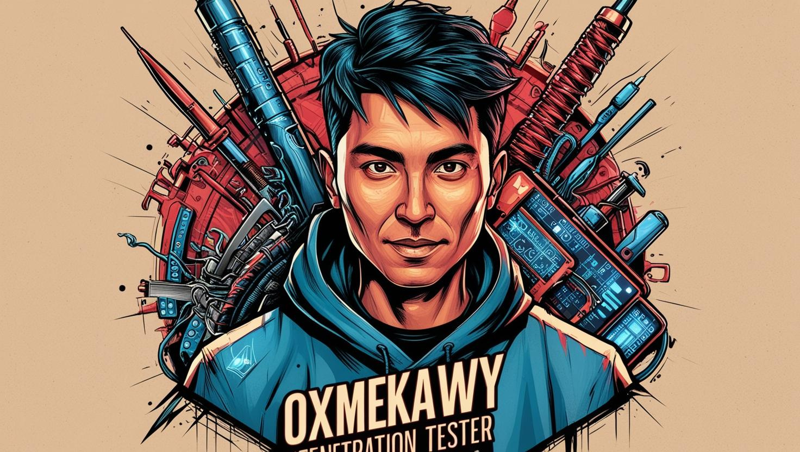

# H0la Fr0m 0xMekawy

## About Me
I am Mohamed Mekawy (0xMekawy), a dedicated cybersecurity professional with a deep passion for ethical hacking, penetration testing, and proactive security strategies. Currently pursuing a degree in Computers and Data Science major cybersecurity, I have developed a strong technical foundation that enables me to approach cybersecurity challenges with precision, analytical thinking, and a hacker’s mindset one that seeks to break security barriers to build stronger defenses.
From the outset of my journey, I immersed myself in programming, networking, and system security, which provided me with a well-rounded understanding of cybersecurity. I began with core programming languages such as Java (OOP), Python, and PHP, which laid the groundwork for understanding system logic and software security. I pursued network security certifications, including CCNA, gaining proficiency in networking protocols, infrastructure security. 
I have completed specialized training in penetration testing methodologies through eJPT, Security+, and EC-Council courses, focusing on identifying, exploiting, and mitigating security vulnerabilities. I have hands-on experience in web application security, network penetration testing, and vulnerability assessment, particularly working with OWASP Top 10 vulnerabilities and exploitation techniques. Understanding the importance of infrastructure security, I have developed strong expertise in network security architecture, intrusion detection, and firewall management. My CCNA certification has enabled me to analyze and secure network environments efficiently. Additionally, I have extensive experience working with Windows and Linux operating systems, particularly Kali Linux and BlackArch, which are essential for penetration testing. 
My interest in low-level security and exploit development has led me to study stack buffer overflow techniques, advanced exploitation tactics and mitigate potential attack vectors. I have an intermediate understanding of cryptography, cryptanalysis, and applied cryptographic techniques, having completed specialized EC-Council courses. With a comprehensive knowledge of SDLC and SSDLC. 
I have gained insights into Blue Team operations, proactive security strategies, and incident response, enabling me to contribute effectively to both attack and defense aspects of cybersecurity. I am committed to identifying weaknesses before malicious actors do leveraging penetration testing, ethical hacking, and proactive security strategies to strengthen digital infrastructures. 
Let's, Breaking In To Lock It Down.

## Cybersecurity student@Faculty of computers and data science, Alexandria university
- Learn the fundamentals of computer science and gain a broad understanding of various cybersecurity domains. Explore specialized modules and subjects within each field, including Secure Coding, Secure Software Design, Mobile Application Security, Web Application Security, Network (LAN-WAN) Security, IoT Security, and Operating System Security.
- Acquire foundational knowledge of data science tools to facilitate seamless integration with security systems. Leverage these capabilities for advanced applications such as malware analysis, bug bounty enumeration, CVE mitigation, and dark web monitoring.

## Skills
- Network Penetration Testing
- Web Penetration Testing
- Vulnerability Assessment
- Network Security
- System Hardening
- Exploit Development and Evasion Techniques
- Windows Security
- Linux Security

## Programming Languages

## Databases

## Vulnerability Assessment tools

## Cources

## Certificates
(https://www.credly.com/users/mohamed-said-mekawy.c4cdc5d3)

## Links

